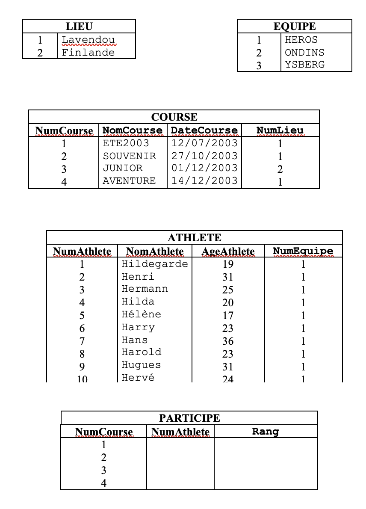

# Base de données COURSE

Vous disposez du schéma conceptuel des données suivant :

On vous demande d'implanter la base de données, de saisir un jeu d'essai, puis de préparer les requêtes pour les programmeurs.

## Construction de la base de données

### Déduire le schéma de relationnel du schéma conceptuel des données présenté ci-dessus

### Créer la base de données 

### Saisir un jeu d'essai
Un mode-opératoire sera réalisé (ou complété) pour les utilisateurs de l'entreprise.

## Écriture des requêtes

a.	Noms des athlètes de l'équipe des ONDINS.
b.	Noms des courses ayant eu lieu en Finlande.
c.	Noms des athlètes ayant participé à la course ETE2002.
d.	Nom, age et rang de tous les athlètes ayant participé à une course (par ordre de course et de rang)
e.	Noms des athlètes (+ nom équipe) n’ayant participé à aucune course.
f.	Noms des athlètes ayant participé aux mêmes courses qu’Hubert
g.	Nom et lieu des courses dont les résultats n’ont pas encore été enregistrés (pas de participants)

