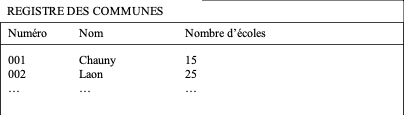
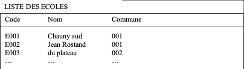
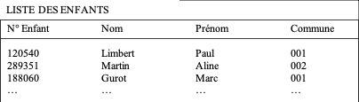
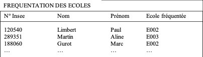
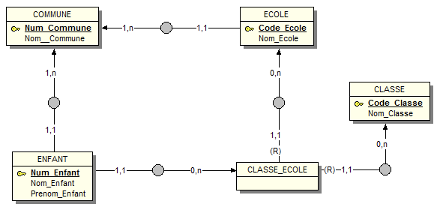

# DB Suivi des enfants scolarisés en primaire

Le département de l ‘Aisne souhaite informatiser le suivi des enfants scolarisés en primaire sur son territoire. Chaque enfant habite une commune et fréquente une école du département. 

Les entretiens menés ont permis de collecter les documents présentés ci-dessous.

Numéro	| Nom |	Nombre d’écoles |
-- | -- | -- |
001	| Chauny	| |
002 |	Laon | |	

## Travail à faire: 

1.	Construire le schéma conceptuel des données (MCD) et le schéma relationnel des données (MRD ou MLD).

ECOLE(Code_Ecole, Nom_Ecole, #Num_Commune)
CLASSE(Code_Classe, Nom_Classe)
CLASSE_ECOLE(#Code_Classe, #Code_Ecole, Nom_Classe)
ENFANT(Num_Enfant, Nom_Enfant, Prénom_Enfant, #Code_Classe, #Code_Ecole)
COMMUNE(Num_Commune, Nom_Commune)

2.	Implantez le schéma sur un SGBDR et saisissez les n-uplets correspondants aux informations présentées sur les documents.

3.	Ajoutez les informations suivantes dans votre base de données :
-	la commune de Crépy en Laonnois (numéro 003) et son unique école communale « la forêt » (code E004),
-	l’enfant Leroy Yolande, N° Enfant 290020 habitant à Crépy en Laonnois et scolarisée à l’école « la forêt ».

4.	La petite Yolande, jusqu’à présent scolarisée en CE2 passe en CM1. L’école « la forêt » ne possède pas de section de CM1 (Crépy en Laonnois est une petite commune). Yolande Leroy ira donc a l’école du plateau à Laon. Saisissez les modifications qui s’imposent dans votre base de données.

5.	Créez et exécutez une requête présentant l’ensemble des informations concernant les enfants : n° enfant, nom, prénom, nom de la commune d’habitation et nom de l’école fréquentée.

## Ecrire en SQL les requêtes suivantes

1.	Donnez la liste des écoles.
2.	Donnez la liste des classes de l'école "Jean Rostand".
3.	Liste des enfants scolarisés en CM2 à l'école "Jean Rostand".
4.	Liste des enfants scolarisés dans la commune de "Laon". La liste sera triée sur les  nom et prénom des enfants.
5.	Changer un enfant de classe dans la même école, du CE1 au CE2.
6.	Ajouter un nouvel enfant en CE1 dans l'école "Jean Rostand".

