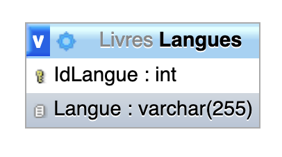
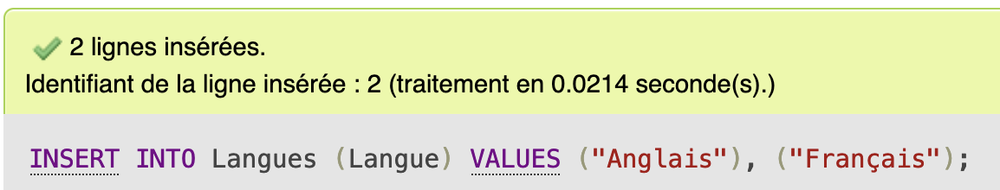
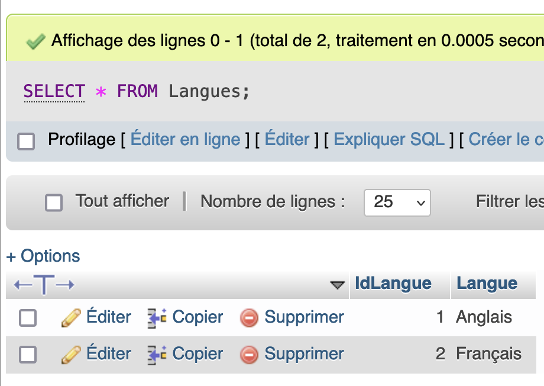
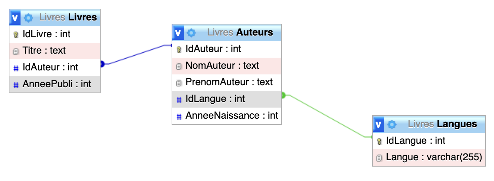
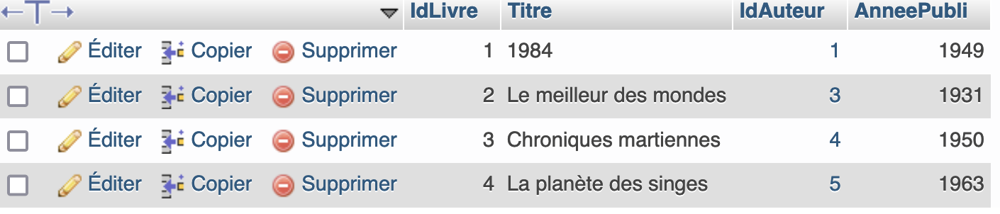
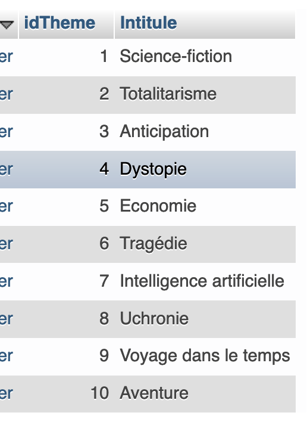
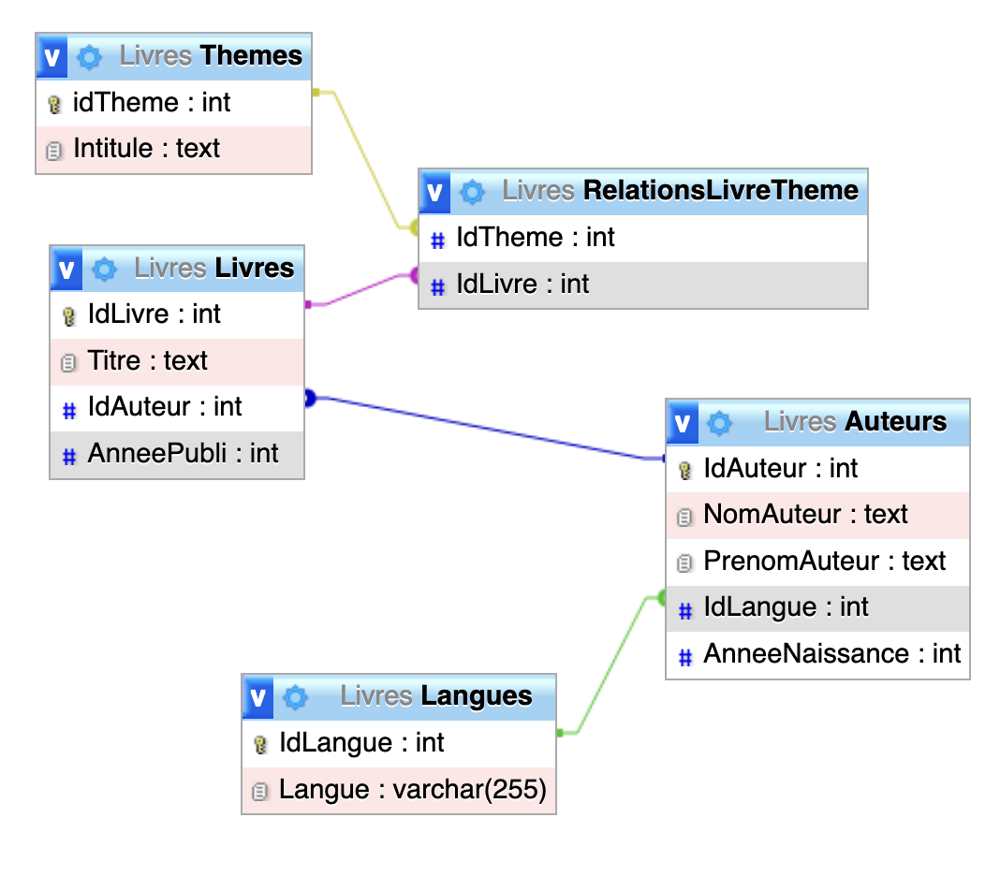

# Découverte du langage SQL

[Source](https://notebooks.lecluse.fr)

[[TOC]]

***

Dans ce TP jous allons découvrir le langage **SQL** (*Structured Query Language*) qui est le langage utilisé pour effectuer des requêtes sur une base de données relationnelles.

Nous apprendrons lors de ce TP à:
- créer des tables avec les attributs que l'on souhaite
- insérer des enregistrements
- faire des requêtes sur la base pour extraire des informations

***

## Créer la base de données

Nous allons commencer par créer une base vide dans laquelle nous allons travailler :

```sql
/* Create database */
CREATE DATABASE Livres;
```

La base s'appelle **Livres**.

Cette base sera constituée de 4 tables :
- Auteurs
- Livres
- Langues
- Themes

## Créer une table

Il est temps de commencer à peupler notre base de données. 

Nous allons commencer par créer la table **Langues** en saisissant notre première requête :

```sql
CREATE TABLE Langues 
(
	IdLangue int NOT NULL AUTO_INCREMENT,
	Langue varchar(255),
	PRIMARY KEY (IdLangue)
);
```

***

### Quelques explications :

La première requête **SQL** que nous allons apprendre est la requête `CREATE TABLE`

- on indique le nom de la table à créer
- entre parenthèse on liste les *attributs* à mettre ainsi que leur *type*.
- une requête se termine **toujours** par ;

Nous avons deux types différents dans notre base de données :
- le type **VARCHAR** avec une longueur spécifiée pour tout ce qui est chaîne de caractères
- le type **INTEGER** pour les entiers

***

### PRIMARY KEY ou Clé Primaire

L'attribut **IdLangue** est la *clé primaire* de la table. 
C'est un entier qui commence à 1 et qui sera **automatiquement incrémenté** au fur à mesure que l'on insère des données dans la table.
C'est en indiquant `PRIMARY KEY` après le type dans la déclaration de l'attribut **IdLangue** que le système de base de données se comporte ainsi.

***

## Insérer des enregistrements dans la table

Maintenant que nous avons une table vide, il nous faut la remplir avec les données sur les auteurs. 

Nous utiliserons pour cela la requête **INSERT**. Voici son utilisation :

```sql
INSERT INTO Langues 
    (Langue)
VALUES
    ("Anglais"),
    ("Français");
```

***

### Quelques explications :

La requête **INSERT** s'utilise ainsi :

```sql
INSERT INTO ##TABLE##
    (## attributs dont on donne les valeurs##)
VALUES
    (## enregistrement 1 ##),
    ...
    (## enregistrement n ##);
```

On peut refaire une autre requête **INSERT** à la suite si on souhaite ajouter encore des données au bout de la table.

Vous remarquez que l'on ne donne pas de valeur pour l'attribut **IdLangue**. C'est parce qu'on l'a déclaré en `PRIMARY KEY`.
Il est donc **automatiquement géré** par le système de base de données.

Nous verrons cela en lisant le contenu complet de la table.

On est pas obligé de préciser tous les attributs. 
**IdLangue** est un exemple particulier, mais il est possible d'omettre d'autres attributs.
Ils seront alors affectés d'une valeur **nulle**.

A l'issue de la requête, le serveur nous informe que 2 lignes ont été créées.



***

## Lire le contenu d'une table

Nous allons à présent utiliser une requête **SELECT** afin de récupérer le contenu de la table.

Ces requêtes peuvent être très sophistiquées comme on va le voir en fin de TP. Pour le moment, nous nous contenterons de la forme la plus simple :

```sql
SELECT * FROM Langues;
```

Vous voyez donc appraître le contenu de la table.
Vous constatez que la clé primaire **IdLangue** a bien été générée correctement.



***

## A vous de jouer

Créez la table **Auteurs** afin que celle-ci reflète les informations suivantes :

| Nom | Prenom | annee naissance | langue |
| --- | --- | --- | --- |
| Orwell | George | 1903 | Anglais |
| Herbert | Frank | 1920 | Anglais |
| Asimov | Isaac | 1920 | Anglais |
| Huxley | Aldous | 1894 | Anglais |
| Bradbury | Ray | 1920 | Anglais |
| K. Dick | Philip | 1928 | Anglais |
| Barjavel | René | 1911 | Français |
| Boulle | Pierre | 1912 | Français |
| Van Vogt | Alfred Elton | 1912 | Anglais |
| Verne | Jules | 1828 | Français |

Pour cela, vous utiliserez la commande suivante pour créer la table et vous adapterez les données à cette structure.

```sql
CREATE TABLE Auteurs (
    IdAuteur       INTEGER  PRIMARY KEY NOT NULL AUTO_INCREMENT,
    NomAuteur      TEXT,
    PrenomAuteur   TEXT,
    IdLangue       INTEGER,
    AnneeNaissance INTEGER,
    FOREIGN KEY(IdLangue) REFERENCES Langues(IdLangue)
);
```

***

### FOREIGN KEY ou Clé étrangère

Une nouveauté apparaît ici dans la création de la table : 
La table **Auteurs** possède une ***clé étangère*** : *IdLangue*. 

Cette clé est un entier.

Remarquez la ligne `FOREIGN KEY(IdLangue) REFERENCES Langues(IdLangue)`. 

Celle-ci permet de déclarer une *contrainte* sur cette clé afin d'indiquer au serveur que *IdLangue* est une **clé étrangère**.

Le serveur sera alors **responsable de maintenir la cohérence entre les deux tables** que l'on a ainsi reliée.

Cette déclaration n'est pas obligatoire mais **fortement conseillée**.

***

## A vous de jouer

Notre base n'est pas encore complète : 
il nous reste à créer les tables **Livres** et **Themes** qui doivent refléter le contenu suivant :

| Titre | NomAuteur | PrenomAuteur | AnneeNaissance | Langue | AnneePubli | Themes |
| --- | --- | --- | --- | --- | --- | --- |
| 1984 | Orwell | George | 1903 | Anglais | 1949 | Totalitarisme, science-fiction, anticipation, Dystopie |
| Dune | Herbert | Frank | 1920 | Anglais | 1965 | science-fiction, anticipation |
| Fondation | Asimov | Isaac | 1920 | Anglais | 1951 | science-fiction, Economie |
| Le meilleur des mondes | Huxley | Aldous | 1894 | Anglais | 1931 | Totalitarisme, science fiction, dystopie |
| Fahrenheit 451 | Bradbury | Ray | 1920 | Anglais | 1953 | science-fiction, Dystopie |
| Ubik | K. Dick | Philip | 1928 | Anglais | 1969 | science-fiction, anticipation |
| Chroniques martiennes | Bradbury | Ray | 1920 | Anglais | 1950 | science-fiction, anticipation |
| La nuit des temps | Barjavel | René | 1911 | Français | 1968 | science-fiction, tragédie |
| Blade Runner | K. Dick | Philip | 1928 | Anglais | 1968 | Intelligence artificielle, science fiction |
| Les Robots | Asimov | Isaac | 1920 | Anglais | 1950 | science fiction, Intelligence artificielle |
| La Planète des singes | Boulle | Pierre | 1912 | Français | 1963 | science fiction, Dystopie |
| Ravage | Barjavel | René | 1911 | Français | 1943 | Science-Fiction, anticipation |
| Le Maître du Haut Château | K. Dick | Philip | 1928 | Anglais | 1962 | Dystopie, Uchronie |
| Le monde des A | Van Vogt | Alfred Elton | 1912 | Anglais | 1945 | science fiction, IA |
| La Fin de l’éternité | Asimov | Isaac | 1920 | Anglais | 1955 | science-fiction, voyage dans le temps |
| De la Terre à la Lune | Verne | Jules | 1828 | Français | 1865 | Science-Fiction, aventure |

***

### La table LIVRES

La table **LIVRES** devra avoir la structure décrite dans l'extrait suivant :

| IdLivre | Titre | IdAuteur | AnneePubli |
| --- | --- | --- | --- |
| ... | ... | ... | ... |
| 8   | La nuit des temps | 7   | 1968 |
| ... | ... | ... | ... |

- l'année de publication est de type **INTEGER**
- **IdLivre** désigne bien sûr la clé primaire
- **IdAuteur** est une *clé externe* faisant référence à l'auteur.
- dans l'extrait, la clé **IdAuteur** vaut 7. L'auteur de *La nuit des temps* est donc *Barjavel*
- on ne renseigne pas la langue ou l'année de naissance de l'auteur car ces informations sont déjà présentes dans la table **Auteurs**.
- On traitera la problématique des thèmes plus tard...

Dans la cellule ci-dessous, saisissez la requête pour créer la table **Livres**

```sql
CREATE TABLE Livres (
    IdLivre       INTEGER  PRIMARY KEY NOT NULL AUTO_INCREMENT,
    Titre      TEXT,
    IdAuteur	INTEGER,
    AnneePubli      INTEGER,
    FOREIGN KEY(IdAuteur) REFERENCES Auteurs(IdAuteur)
);
```

On commence à avoir les liaisons entre les tables correpondant à:



A présent, saisissez les données à l'intérieur des tables.

```sql
# Dans la table Auteurs
INSERT INTO `Auteurs` (`NomAuteur`, `PrenomAuteur`, `IdLangue`, `AnneeNaissance`) VALUES ('Orwell', 'George', '1', '1903');

INSERT INTO `Auteurs` (`NomAuteur`, `PrenomAuteur`, `IdLangue`, `AnneeNaissance`) VALUES ('Asimov', 'Isaac', '1', '1920');

INSERT INTO `Auteurs` (`NomAuteur`, `PrenomAuteur`, `IdLangue`, `AnneeNaissance`) VALUES ('Huxley', 'Aldous', '1', '1894');

INSERT INTO `Auteurs` (`NomAuteur`, `PrenomAuteur`, `IdLangue`, `AnneeNaissance`) VALUES ('Bradbury', 'Ray', '1', '1920');

INSERT INTO `Auteurs` (`NomAuteur`, `PrenomAuteur`, `IdLangue`, `AnneeNaissance`) VALUES ('Boulle', 'Pierre', '2', '1912');
```

Dans la table **Livres**:

```sql
INSERT INTO `Livres` 
(`IdLivre`, `Titre`, `IdAuteur`, `AnneePubli`) VALUES 
('1984', '1', '1949'),
('Le meilleur des mondes', '3', '1931'),
('Chroniques martiennes', '4', '1950'),
('La planète des singes', '5', '1963');
```

Vérifiez votre travail en listant tous les enregistrements de la table **LIVRES** avec la requête suivante:

```sql
SELECT * FROM Livres;
```



***

> #### 🔧 **Travail à réaliser**
> 
> Complétez la saisie avec toutes les données fournies dans le tableau global pour vous entraîner.
> Tous les livres, tous les auteurs.

***

### La table Themes

Traitons à présent la problématique des **Thèmes**. 

La table **Themes** devra avoir la structure décrite dans l'extrait suivant :

| IdTheme | Intitule |
| --- | --- |
| 1   | Science-fiction |
| ... | ... |

- **IdTheme** désigne bien sûr la **clé primaire**
- **Intitule** est un champ texte contenant l'**intitulé** du thème tel qu'il apparaît dans le tableau global.

Vous saisirez donc 2 requêtes :

- Une pour **créer** la table Themes
- Une pour **insérer** les données dans la table.

```sql
CREATE TABLE Themes (
    IdTheme       INTEGER  PRIMARY KEY NOT NULL AUTO_INCREMENT,
    Intitule      TEXT
);
```

***

> #### 🔧 **Travail à réaliser**
> 
> Réalisez la requête d'insertion des données dans la table **Themes**


```sql
INSERT INTO `Themes` (`Intitule`) VALUES
('Science-fiction'), ('Totalitarisme'), ('Anticipation'), ('Dystopie'), ('Economie'), ('Tragédie'), ('Intelligence artificielle'), ('Uchronie'), ('Voyage dans le temps'), ( 'Aventure');
```

***

Vérifiez votre travail en lisant tous les enregistrements de la table **Themes**.

```sql
SELECT * FROM Themes;
```


***

### Une table manquante !

La saisie de notre base de données est incomplète !

Nous avons en effet saisi tous les **auteurs**, tous les **livres**, toutes les **langues**, tous les **thèmes** et pourtant il manque une information.

Laquelle ?

Quelle solution envisager pour saisir cette information ?

Créer une table **RelationsLivreTheme** mettant en relation les livres et les thèmes associés. 

On utilisera pour cela les **clés étrangères**.


```sql  
CREATE TABLE RelationsLivreTheme (
    IdTheme      INTEGER  NOT NULL,
    IdLivre				INTEGER NOT NULL,
      
    FOREIGN KEY(IdTheme) REFERENCES Themes(IdTheme),
      FOREIGN KEY(IdLivre) REFERENCES Livres(IdLivre)      
);
```


***

> #### 🔧 **Travail à réaliser**
> 
> Saisir le contenu de la table **RelationLivreTheme**

***

## Cardinalité

En regardant notre base de données et les relations que nous avons créé entre les tables, on remarque que celles-ci ont des *cardinalités* différentes. 

> La *cardinalité* d'une relation entre deux tables **A** et **B** exprime à combien d'enregistrements de **A** peut être relié chaque enregistrement de **B**.

Par exemple, à un **livre** est associé un **auteur** unique, mais pour un auteur donné, il peut y avoir plusieurs livres. 
On parle alors de **relation de 1 à n**

Lorsque plusieurs enregistrements de la table **A** peuvent être associés à plusieurs enregistrements de la table **B**, on parle alors d'une **relation de n à n**

***

> ### 🔧 **Travail à réaliser**
> 
> Citez dans la base de données
> - une relation de 1 à n
> - une relation de n à n

***

### Table de relation

Pour une **relation de n à n**, nous aurons en général recours à la création d'une **nouvelle table de relation** contenant les clés externes des tables à mettre en relation.

C'est ce que nous avons mis en oeuvre pour la table **RelationsLivreTheme**.


***

## Correction

```sql
SET FOREIGN_KEY_CHECKS=0;
START TRANSACTION;

CREATE TABLE `Auteurs` (
  `IdAuteur` int NOT NULL,
  `NomAuteur` text,
  `PrenomAuteur` text,
  `IdLangue` int DEFAULT NULL,
  `AnneeNaissance` int DEFAULT NULL
) ENGINE=InnoDB DEFAULT CHARSET=utf8mb4 COLLATE=utf8mb4_0900_ai_ci;

INSERT INTO `Auteurs` (`IdAuteur`, `NomAuteur`, `PrenomAuteur`, `IdLangue`, `AnneeNaissance`) VALUES(1, 'Orwell', 'George', 1, 1903);
INSERT INTO `Auteurs` (`IdAuteur`, `NomAuteur`, `PrenomAuteur`, `IdLangue`, `AnneeNaissance`) VALUES(2, 'Asimov', 'Isaac', 1, 1920);
INSERT INTO `Auteurs` (`IdAuteur`, `NomAuteur`, `PrenomAuteur`, `IdLangue`, `AnneeNaissance`) VALUES(3, 'Huxley', 'Aldous', 1, 1894);
INSERT INTO `Auteurs` (`IdAuteur`, `NomAuteur`, `PrenomAuteur`, `IdLangue`, `AnneeNaissance`) VALUES(4, 'Bradbury', 'Ray', 1, 1920);
INSERT INTO `Auteurs` (`IdAuteur`, `NomAuteur`, `PrenomAuteur`, `IdLangue`, `AnneeNaissance`) VALUES(5, 'Boulle', 'Pierre', 2, 1912);

CREATE TABLE `Langues` (
  `IdLangue` int NOT NULL,
  `Langue` varchar(255) DEFAULT NULL
) ENGINE=InnoDB DEFAULT CHARSET=utf8mb4 COLLATE=utf8mb4_0900_ai_ci;

INSERT INTO `Langues` (`IdLangue`, `Langue`) VALUES(1, 'Anglais');
INSERT INTO `Langues` (`IdLangue`, `Langue`) VALUES(2, 'Français');

CREATE TABLE `Livres` (
  `IdLivre` int NOT NULL,
  `Titre` text,
  `IdAuteur` int DEFAULT NULL,
  `AnneePubli` int DEFAULT NULL
) ENGINE=InnoDB DEFAULT CHARSET=utf8mb4 COLLATE=utf8mb4_0900_ai_ci;

INSERT INTO `Livres` (`IdLivre`, `Titre`, `IdAuteur`, `AnneePubli`) VALUES(1, '1984', 1, 1949);
INSERT INTO `Livres` (`IdLivre`, `Titre`, `IdAuteur`, `AnneePubli`) VALUES(2, 'Le meilleur des mondes', 3, 1931);
INSERT INTO `Livres` (`IdLivre`, `Titre`, `IdAuteur`, `AnneePubli`) VALUES(3, 'Chroniques martiennes', 4, 1950);
INSERT INTO `Livres` (`IdLivre`, `Titre`, `IdAuteur`, `AnneePubli`) VALUES(4, 'La planète des singes', 5, 1963);

CREATE TABLE `RelationsLivreTheme` (
  `IdTheme` int NOT NULL,
  `IdLivre` int NOT NULL
) ENGINE=InnoDB DEFAULT CHARSET=utf8mb4 COLLATE=utf8mb4_0900_ai_ci;

CREATE TABLE `Themes` (
  `idTheme` int NOT NULL,
  `Intitule` text NOT NULL
) ENGINE=InnoDB DEFAULT CHARSET=utf8mb4 COLLATE=utf8mb4_0900_ai_ci;

INSERT INTO `Themes` (`idTheme`, `Intitule`) VALUES(1, 'Science-fiction');
INSERT INTO `Themes` (`idTheme`, `Intitule`) VALUES(2, 'Totalitarisme');
INSERT INTO `Themes` (`idTheme`, `Intitule`) VALUES(3, 'Anticipation');
INSERT INTO `Themes` (`idTheme`, `Intitule`) VALUES(4, 'Dystopie');
INSERT INTO `Themes` (`idTheme`, `Intitule`) VALUES(5, 'Economie');
INSERT INTO `Themes` (`idTheme`, `Intitule`) VALUES(6, 'Tragédie');
INSERT INTO `Themes` (`idTheme`, `Intitule`) VALUES(7, 'Intelligence artificielle');
INSERT INTO `Themes` (`idTheme`, `Intitule`) VALUES(8, 'Uchronie');
INSERT INTO `Themes` (`idTheme`, `Intitule`) VALUES(9, 'Voyage dans le temps');
INSERT INTO `Themes` (`idTheme`, `Intitule`) VALUES(10, 'Aventure');


ALTER TABLE `Auteurs`
  ADD PRIMARY KEY (`IdAuteur`),
  ADD KEY `IdLangue` (`IdLangue`);

ALTER TABLE `Langues`
  ADD PRIMARY KEY (`IdLangue`);

ALTER TABLE `Livres`
  ADD PRIMARY KEY (`IdLivre`),
  ADD KEY `IdAuteur` (`IdAuteur`);

ALTER TABLE `RelationsLivreTheme`
  ADD KEY `IdTheme` (`IdTheme`),
  ADD KEY `IdLivre` (`IdLivre`);

ALTER TABLE `Themes`
  ADD PRIMARY KEY (`idTheme`);


ALTER TABLE `Auteurs`
  MODIFY `IdAuteur` int NOT NULL AUTO_INCREMENT;

ALTER TABLE `Langues`
  MODIFY `IdLangue` int NOT NULL AUTO_INCREMENT;

ALTER TABLE `Livres`
  MODIFY `IdLivre` int NOT NULL AUTO_INCREMENT;

ALTER TABLE `Themes`
  MODIFY `idTheme` int NOT NULL AUTO_INCREMENT;


ALTER TABLE `Auteurs`
  ADD CONSTRAINT `auteurs_ibfk_1` FOREIGN KEY (`IdLangue`) REFERENCES `Langues` (`IdLangue`);

ALTER TABLE `Livres`
  ADD CONSTRAINT `livres_ibfk_1` FOREIGN KEY (`IdAuteur`) REFERENCES `Auteurs` (`IdAuteur`);

ALTER TABLE `RelationsLivreTheme`
  ADD CONSTRAINT `relationslivretheme_ibfk_1` FOREIGN KEY (`IdTheme`) REFERENCES `Themes` (`idTheme`),
  ADD CONSTRAINT `relationslivretheme_ibfk_2` FOREIGN KEY (`IdLivre`) REFERENCES `Livres` (`IdLivre`);
SET FOREIGN_KEY_CHECKS=1;
COMMIT;
```