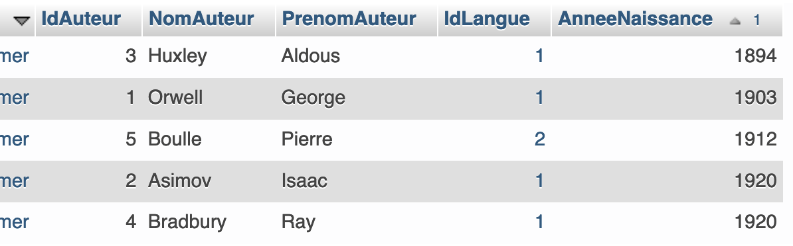
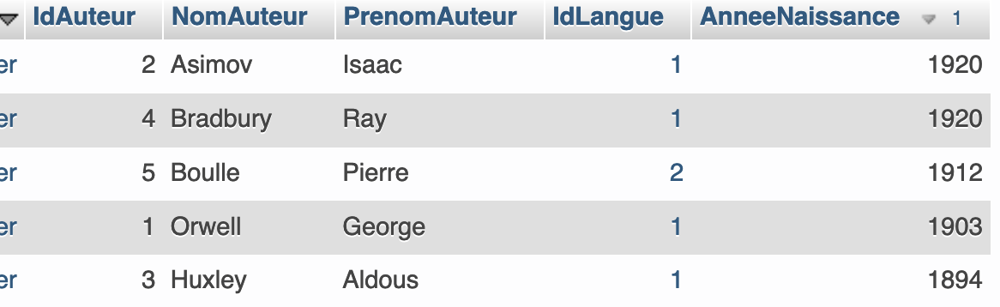
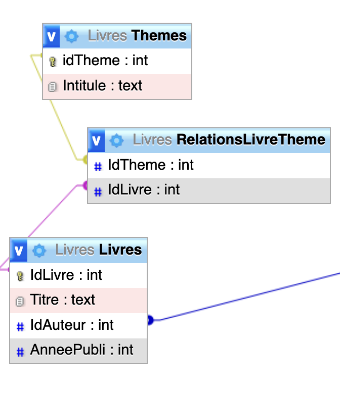

# SQL - Aller plus loin

[Source](https://notebooks.lecluse.fr)

[[TOC]]

***

# Aller plus loin en SQL

Dans ce classeur, nous poursuivrons l'étude de l'exemple de la base de données de livres de SF et nous verrons des **requêtes de sélection avancées** ainsi que la manière de **fusionner** plusieurs tables (**Jointures**).

Rendez vous sur l'interface de gestion de votre base de données.

* PHPMyAdmin
* SQLServer Mangament Console

***

## Aller plus loin avec SELECT.

### Sélection simple

Supposons que l'on veuille lister **seulement** les noms et prénoms des auteurs **nés avant 1900**, on utilisera une clause **WHERE** *condition* :

```sql
SELECT NomAuteur, PrenomAuteur 
FROM Auteurs 
WHERE AnneeNaissance < 1900;
```

Pour obtebir les auteurs prénommés *Jules* :

```sql
SELECT NomAuteur, PrenomAuteur from Auteurs WHERE PrenomAuteur = 'Jules';
```

Vous voyez que les textes sont délimités par des quotes **'...'**.

***Attention*** : essayez de remplacer **Jules** par **jules** et vous constaterez que **la recherche est sensible aux majuscules.**

***

### Sélection avec LIKE

Supposons maintenant que l'on recherche les auteurs dont le prénom commence par **P** : 

Nous utiliserons une clause *LIKE* de cette manière :

```sql
SELECT NomAuteur, PrenomAuteur 
FROM Auteurs 
WHERE PrenomAuteur LIKE 'P%';
```

Le caractère **%** est le caractère joker (wildcard) en sql.

***

### Sélection multiple

Il est possible de croiser plusieurs critères à l'aide d'opérateurs booleens : **AND** et **OR**. Voici la liste des auteurs français nés après 1900 :

```sql
SELECT NomAuteur, PrenomAuteur 
FROM Auteurs 
WHERE IdLangue = 2 
AND AnneeNaissance > 1900;
```


***

### Compter le nombre de réponses d'une requête SELECT

Combien y a t-il d'auteurs nés entre 1900 et 1915 ? 
Vous verrez à l'occation l'utilisation de l'opérateur *BETWEEN* pour tester l'appartenance à un intervalle.

```sql
SELECT COUNT(*)
FROM Auteurs
WHERE AnneeNaissance BETWEEN 1900 AND 1915;
```

***


### Trier les réponses

Nous allons lister **tous les auteurs par ordre croissant d'année de naissance**

```sql
SELECT *
FROM Auteurs
ORDER BY AnneeNaissance;
```



et par ordre décroissant, on ajoute **DESC** à la fin de la requête

```sql
SELECT *
FROM Auteurs
ORDER BY AnneeNaissance DESC;
```



***

### Éviter les occurrences multiples

Interrogeons la table **Livres** sur les **années de publication**, rangées par ordre **croissant** :

```sql
SELECT AnneePubli
FROM Livres
ORDER BY AnneePubli;
```

On peut constater la présence de quelques doublons.

Pour **éviter les redondances** dans les résultats, on peut rajouter le mot-clé *DISTINCT* juste après le *SELECT* :

```sql
SELECT DISTINCT AnneePubli
FROM Livres 
ORDER BY AnneePubli;
```

***

> ### 🔧 **Travail à réaliser**
> 
> 1.  Donner la liste de tous les titres des livres écrits entre 1920 et 1950.
> 2.  Combien y en a t-il ?

***

## Requêtes portant sur plusieurs tables

Jusqu'à présent, nos requêtes ne portaient que sur **une seule table**. 

Néanmoins notre liste de livres comporte des donées en provenance de plusieurs tables simultanément. 
Nous allons voir comment effectuer des requêtes pour **croiser des données** en provenance de plusieurs tables.

```sql
SELECT * 
FROM Langues, Auteurs;
```

Comme on peut le constater cette requête est peu pertinente car elle affiche **toutes les données de chacune des tables sans effectuer de correspondances**.

La **clé de jointure** apparaît pourtant ici clairement : 
* il s'agit de **id_langue** qui doit permettre de recouper les informations entre les deux tables : il est en effet inutile d'afficher les données pour lesquelles les langues ne correspondent pas entre les deux tables.

***

### Jointure

La **jonture** consiste à croiser les données de plusieurs tables pour les présenter sous forme d'un seul tableau. 

On va utiliser ce mécanisme pour afficher clairement la langue de l'auteur plutôt qu'un numéro qui n'est pas forcément très parlant. 
Nous utiliserons pour cela l'opérateur **JOIN ... ON** :

```sql
SELECT NomAuteur, PrenomAuteur, Langue, AnneeNaissance
FROM Auteurs 
JOIN Langues 
ON Auteurs.IdLangue = Langues.IdLangue;
```

Les champs sur lesquels faire la jointure **ayant les mêmes noms dans les 2 tables**, cette requête peut aussi être écrite plus simplement en utilisant le mot-clé **USING** ainsi :

```
SELECT NomAuteur, PrenomAuteur, Langue, AnneeNaissance
FROM Auteurs 
JOIN Langues 
USING (IdLangue);
```

***

> ### 🔧 **Travail à réaliser**
> 
> En croisant la table **Livres** avec la table **Auteurs**
> 1.  Afficher une liste présentant les champs **Titre**, **PrenomAuteur**, **NomAuteur** et **AnneePubli**, triée du **plus récent au plus ancien**.
> 2.  Afficher une liste présentant les champs  **Titre**, **PrenomAuteur**, **NomAuteur** et **AnneePubli** écrits en français.

***

### Le cas des relations de n à n

Parfois il arrive que les données à collecter se trouvent **dans plus que deux tables** :
c'est le cas des **Thèmes pour les livres** 

Ce cas nécessite l'analyse de 3 tables : **Livres** et **Thèmes** bien sûr, mais aussi la table de relation **RelationsLivreTheme**.


Observez et étudiez la requête suivante : 
* Le principe est d'enchaîner deux jointures **JOIN ... USING** en utilisant ***la table de Relation au milieu***. 

* En effet, la requête se lit de la gauche vers la droite et **on ne peut faire de jointure que si on a une clé externe en commun**, ce qui n'est par exemple pas le cas entre **Livres** et **Thèmes**.

```sql
SELECT Titre, Intitule
FROM Livres 
JOIN RelationsLivreTheme 
USING (IdLivre) 
JOIN Themes USING (IdTheme);
```

***

> ### 🔧 **Travail à réaliser**
> 
> Ecrire une requête permettant d'obtenir une liste dont les attributs sont **Titre**, **NomAuteur** et **Langue** triée par ordre croissant de date de naissance de l'auteur.