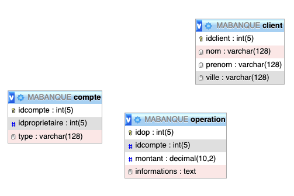

# MaBanque



**Aucune clé étrangère dans cette base!**

## Schéma

```sql
CREATE TABLE client (
    idclient int(5) NOT NULL,
    nom varchar(128) NOT NULL,
    prenom varchar(128) NOT NULL,
    ville varchar(128) NOT NULL,
    PRIMARY KEY (idclient)
    );
CREATE TABLE compte (
    idcompte int(5) NOT NULL,
    idproprietaire int(5) NOT NULL,
    type varchar(128) NOT NULL,
    PRIMARY KEY (idcompte)
    );
CREATE TABLE operation (
    idop int(5) NOT NULL,
    idcompte int(5) NOT NULL,
    montant decimal(10,2) NOT NULL,
    informations text NOT NULL,
    PRIMARY KEY (idop)
);
```

## Requêtes

### Donner le nom et le prénom de tous les clients
```sql
SELECT nom, prenom
FROM client;
```

### Donner le nom et le prénom des clients habitant à Paris
```sql
SELECT nom, prenom
FROM client
WHERE lower(ville) = 'paris';
```

### Donner les identifiants des comptes de type Livret A

```sql
SELECT idcompte
FROM compte
WHERE type = 'Livret A';
```

### Donner les identifiants des opérations de débit sur le compte d’identifiant égal à 1

```sql
SELECT idop, montant
FROM operation
WHERE (idcompte = 1) AND (montant < 0);
```

### Donner, sans doublon, les identifiants des propriétaires de livret A, classés par ordre croissant

```sql
SELECT DISTINCT idproprietaire
FROM compte
WHERE type = ’Livret A’
ORDER BY idproprietaire;
```

### Donner l’identifiant des clients n’ayant pas de livret A

```sql
SELECT idclient
FROM client
WHERE idclient 
	NOT IN
		(SELECT idproprietaire
			FROM compte
			WHERE type = 'Livret A'
		)
ORDER BY idclient;
```

### Donner l’identifiant de compte et le type de compte des clients habitant à Paris

```sql
SELECT idcompte, type
FROM compte
WHERE idproprietaire 
IN
	(SELECT idclient
		FROM client
		WHERE ville = 'Paris');
```

### Donner la liste des comptes et les types de compte de Dumbledore

```sql
SELECT idproprietaire, idcompte, type
FROM compte
WHERE idproprietaire 
IN
	(SELECT idclient 
	 FROM client
	WHERE nom = 'Dumbledore');
```

### Donner le nombre de clients par ville, classé par ordre alphabétique de villes

```sql
SELECT ville, COUNT(idclient)
FROM client
GROUP BY ville
ORDER BY ville;
```

### Donner la ville ayant le plus de clients

On passe par une table temporaire
```sql
SELECT ville, max(nb)
FROM 
	(
		SELECT ville, COUNT(idclient) AS nb
		FROM client
		GROUP BY ville
	) AS TMP;
```
	
```sql
SELECT ville, COUNT(idclient)
FROM client
GROUP BY ville
ORDER BY COUNT(idclient) DESC;
```

### Trouver le nombre d’opérations effectuées sur chaque compte

```sql
SELECT idcompte, COUNT(idop)
FROM operation
GROUP BY idcompte;
```

### Trouver le nombre maximum d’opérations effectuées sur un compte

```sql
SELECT MAX(nbop)
FROM 
	(
		SELECT idcompte, COUNT(idop) AS nbop
		FROM operation
		GROUP BY idcompte) AS TMP;
```

## Autres requêtes

> cTrouver le ou les numéros de compte réalisant le maximum de la question précédente.
> Afficher, type par type, la moyenne des soldes des comptes (tous clients confondus) de chaque type (en supposant qu’initialement, les comptes sont tous vides).
> Afficher, classé par nom et prénom, le nom, le prénom, le type de compte, et le solde, pour tous les comptes.
> Même question, en se limitant aux clients dont le nom commence par K,L,M ou N.
> Afficher le nom et le prénom des personnes ayant débité au moins un chèque sur leur compte courant, classé par nom.
> Nom, prénom et ville de tous les clients ayant réalisé un nombre maximal d’opérations au guichet.
> Moyenne par ville des fortunes totales des clients (somme sur tous leurs comptes), classé par valeur croissante.


