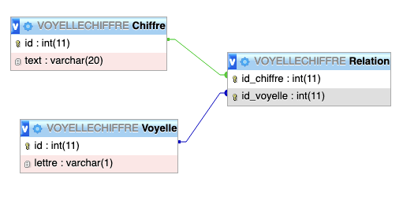

# Voyelle Chiffre



**VoyelleChiffre** associe une table chiffre contenant les chiffres écrits en lettres aux voyelles par l’intermédiaire d’une table relation qui fait le lien à l’aide des clés primaires des deux autres tables.

## Création.

```sql
# La base
CREATE DATABASE VOYELLECHIFFRE;


# Les tables
CREATE TABLE Voyelle(id INT PRIMARY KEY, lettre VARCHAR(1));
CREATE TABLE Chiffre(id INT PRIMARY KEY, text VARCHAR(20));

# La table de relation
CREATE TABLE Relation (id\_chiffre INT, id\_voyelle INT,
PRIMARY KEY (id\_chiffre, id\_voyelle),
FOREIGN KEY (id_chiffre) REFERENCES Chiffre(id),
FOREIGN KEY (id_voyelle) REFERENCES Voyelle(id));
```


## Requêtes demandées

### Afficher tous chiffres en lettres

```sql
SELECT text
FROM `Chiffre`;
```

### Afficher toutes les voyelles

```sql
SELECT lettre
FROM `Voyelle`;
```

### Afficher les chiffres en lettres contenant une et une seule voyelle (having)

```sql
SELECT text, count(text) AS nb
FROM Chiffre
JOIN Relation
ON Relation.id_chiffre = Chiffre.id
GROUP BY Chiffre.id
HAVING nb = 1;
```